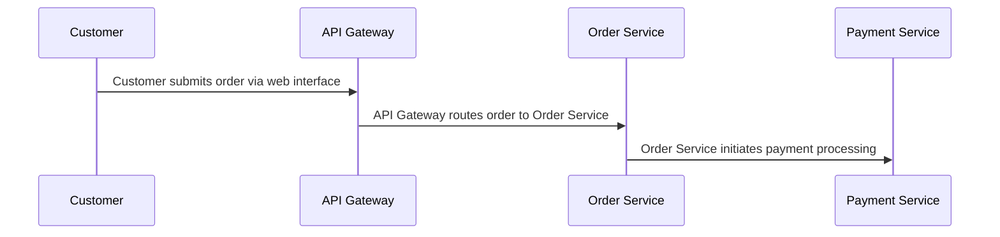

## Details

| Field               | Value                    |
|---------------------|--------------------------|
| **Unique ID**       | order-processing-flow                   |
| **Name**            | Customer Order Processing                 |
| **Description**     | End-to-end flow from customer placing an order to payment confirmation          |

## Sequence Diagram

## Controls

        ### Audit

        All order processing steps must be logged for audit compliance

        

            <table>
                <thead>
                <tr>
                    <th>Requirement URL</th>
                    <th>Config</th>
                </tr>
                </thead>
                <tbody>
                    <tr>
                        <td>
                                <a href="https://internal-policy.example.com/audit/transaction-logging" target="_blank">
                                    https://internal-policy.example.com/audit/transaction-logging
                                </a>
                        </td>

                        <td>
                                <table>
                                    <thead>
                                    <tr>
                                        <th>Key</th>
                                        <th>Value</th>
                                    </tr>
                                    </thead>
                                    <tbody>
                                        <tr>
                                            <td>log-level</td>
                                            <td>detailed</td>
                                        </tr>
                                        <tr>
                                            <td>retention-days</td>
                                            <td>365</td>
                                        </tr>
                                    </tbody>
                                </table>

                        </td>
                    </tr>
                </tbody>
            </table>
        

## Metadata
  _No Metadata defined._
