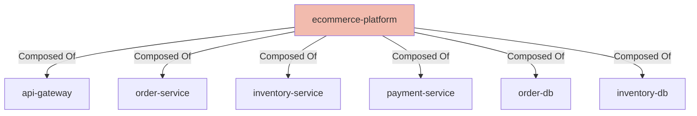

## Details

| Field               | Value                    |
|---------------------|--------------------------|
| **Unique ID**       | ecommerce-platform                   |
| **Node Type**       | system             |
| **Name**            | E-Commerce Platform                 |
| **Description**     | Logical system containing the e-commerce services and databases          |

## Interfaces
    _No interfaces defined._

## Related Nodes

## Controls
    _No controls defined._

## Metadata
  

      <table>
          <thead>
          <tr>
              <th>Key</th>
              <th>Value</th>
          </tr>
          </thead>
          <tbody>
          <tr>
              <td>
                  <b>Owner</b>
              </td>
              <td>
                  Platform Team
                      </td>
          </tr>
          </tbody>
      </table>
  

