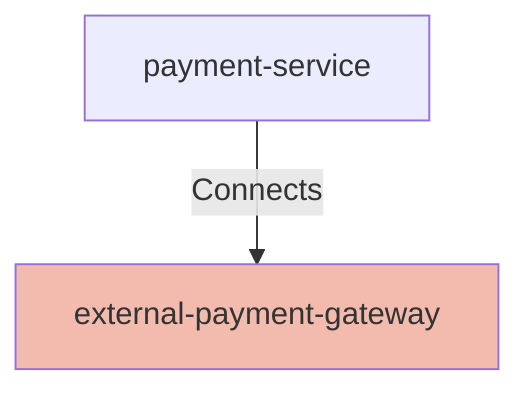

## Details

| Field               | Value                    |
|---------------------|--------------------------|
| **Unique ID**       | external-payment-gateway                   |
| **Node Type**       | system             |
| **Name**            | External Payment Provider                 |
| **Description**     | Third-party payment gateway used to process customer payments          |

## Interfaces
        

            <table>
                <thead>
                <tr>
                    <th>Key</th>
                    <th>Value</th>
                </tr>
                </thead>
                <tbody>
                <tr>
                    <td>
                        <b>UniqueId</b>
                    </td>
                    <td>
                        external-payment-api
                            </td>
                </tr>
                <tr>
                    <td>
                        <b>DefinitionUrl</b>
                    </td>
                    <td>
                        

                            <table>
                                <thead>
                                <tr>
                                    <th>Key</th>
                                    <th>Value</th>
                                </tr>
                                </thead>
                                <tbody>
                                <tr>
                                    <td>
                                        <b>Reference</b>
                                    </td>
                                    <td>
                                        ../patterns/rest-api-interface.json
                                            </td>
                                </tr>
                                <tr>
                                    <td>
                                        <b>_value</b>
                                    </td>
                                    <td>
                                        

                                            <table>
                                                <thead>
                                                <tr>
                                                    <th>Key</th>
                                                    <th>Value</th>
                                                </tr>
                                                </thead>
                                                <tbody>
                                                </tbody>
                                            </table>
                                        

                                    </td>
                                </tr>
                                </tbody>
                            </table>
                        

                    </td>
                </tr>
                <tr>
                    <td>
                        <b>Config</b>
                    </td>
                    <td>
                        

                            <table>
                                <thead>
                                <tr>
                                    <th>Key</th>
                                    <th>Value</th>
                                </tr>
                                </thead>
                                <tbody>
                                <tr>
                                    <td>
                                        <b>Host</b>
                                    </td>
                                    <td>
                                        payments.external
                                            </td>
                                </tr>
                                <tr>
                                    <td>
                                        <b>Port</b>
                                    </td>
                                    <td>
                                        443
                                            </td>
                                </tr>
                                <tr>
                                    <td>
                                        <b>BasePath</b>
                                    </td>
                                    <td>
                                        /api
                                            </td>
                                </tr>
                                <tr>
                                    <td>
                                        <b>Authentication</b>
                                    </td>
                                    <td>
                                        API-Key
                                            </td>
                                </tr>
                                </tbody>
                            </table>
                        

                    </td>
                </tr>
                </tbody>
            </table>
        

## Related Nodes

## Controls
    _No controls defined._

## Metadata
  

      <table>
          <thead>
          <tr>
              <th>Key</th>
              <th>Value</th>
          </tr>
          </thead>
          <tbody>
          <tr>
              <td>
                  <b>Owner</b>
              </td>
              <td>
                  External Vendor
                      </td>
          </tr>
          <tr>
              <td>
                  <b>Contact</b>
              </td>
              <td>
                  support@payments.example.com
                      </td>
          </tr>
          </tbody>
      </table>
  

