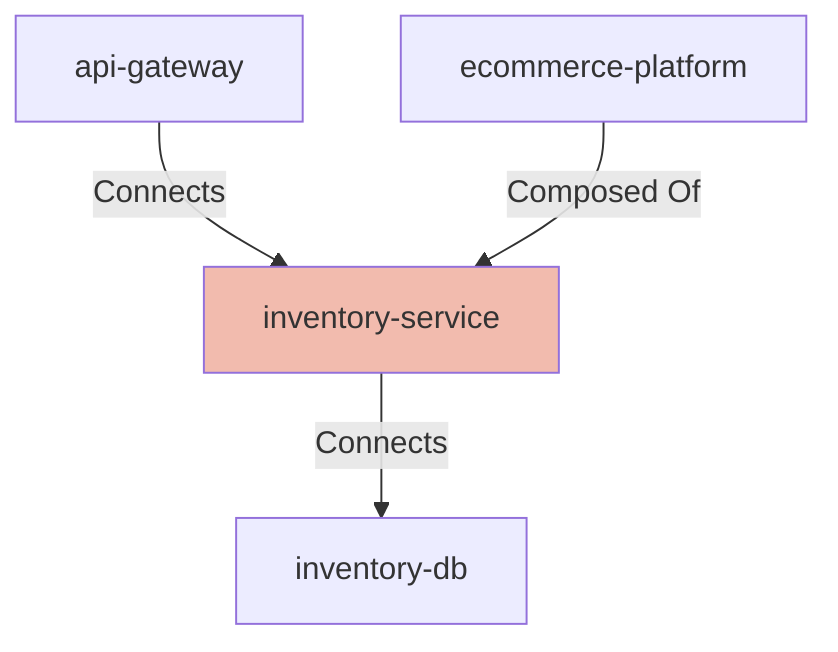

## Details

| Field               | Value                    |
|---------------------|--------------------------|
| **Unique ID**       | inventory-service                   |
| **Node Type**       | service             |
| **Name**            | Inventory Service                 |
| **Description**     | Maintains product inventory and availability          |

## Interfaces
        

            <table>
                <thead>
                <tr>
                    <th>Key</th>
                    <th>Value</th>
                </tr>
                </thead>
                <tbody>
                <tr>
                    <td>
                        <b>UniqueId</b>
                    </td>
                    <td>
                        inventory-service-http
                            </td>
                </tr>
                <tr>
                    <td>
                        <b>DefinitionUrl</b>
                    </td>
                    <td>
                        

                            <table>
                                <thead>
                                <tr>
                                    <th>Key</th>
                                    <th>Value</th>
                                </tr>
                                </thead>
                                <tbody>
                                <tr>
                                    <td>
                                        <b>Reference</b>
                                    </td>
                                    <td>
                                        ../patterns/rest-api-interface.json
                                            </td>
                                </tr>
                                <tr>
                                    <td>
                                        <b>_value</b>
                                    </td>
                                    <td>
                                        

                                            <table>
                                                <thead>
                                                <tr>
                                                    <th>Key</th>
                                                    <th>Value</th>
                                                </tr>
                                                </thead>
                                                <tbody>
                                                </tbody>
                                            </table>
                                        

                                    </td>
                                </tr>
                                </tbody>
                            </table>
                        

                    </td>
                </tr>
                <tr>
                    <td>
                        <b>Config</b>
                    </td>
                    <td>
                        

                            <table>
                                <thead>
                                <tr>
                                    <th>Key</th>
                                    <th>Value</th>
                                </tr>
                                </thead>
                                <tbody>
                                <tr>
                                    <td>
                                        <b>Host</b>
                                    </td>
                                    <td>
                                        inventory.internal
                                            </td>
                                </tr>
                                <tr>
                                    <td>
                                        <b>Port</b>
                                    </td>
                                    <td>
                                        8081
                                            </td>
                                </tr>
                                <tr>
                                    <td>
                                        <b>BasePath</b>
                                    </td>
                                    <td>
                                        /inventory
                                            </td>
                                </tr>
                                <tr>
                                    <td>
                                        <b>Authentication</b>
                                    </td>
                                    <td>
                                        OAuth2
                                            </td>
                                </tr>
                                </tbody>
                            </table>
                        

                    </td>
                </tr>
                </tbody>
            </table>
        

## Related Nodes

## Controls
    _No controls defined._

## Metadata
  

      <table>
          <thead>
          <tr>
              <th>Key</th>
              <th>Value</th>
          </tr>
          </thead>
          <tbody>
          <tr>
              <td>
                  <b>Owner</b>
              </td>
              <td>
                  Inventory Team
                      </td>
          </tr>
          <tr>
              <td>
                  <b>Repository</b>
              </td>
              <td>
                  https://git.example.com/org/inventory-service
                      </td>
          </tr>
          <tr>
              <td>
                  <b>Deployment Type</b>
              </td>
              <td>
                  container
                      </td>
          </tr>
          <tr>
              <td>
                  <b>Sla Tier</b>
              </td>
              <td>
                  tier-2
                      </td>
          </tr>
          </tbody>
      </table>
  

