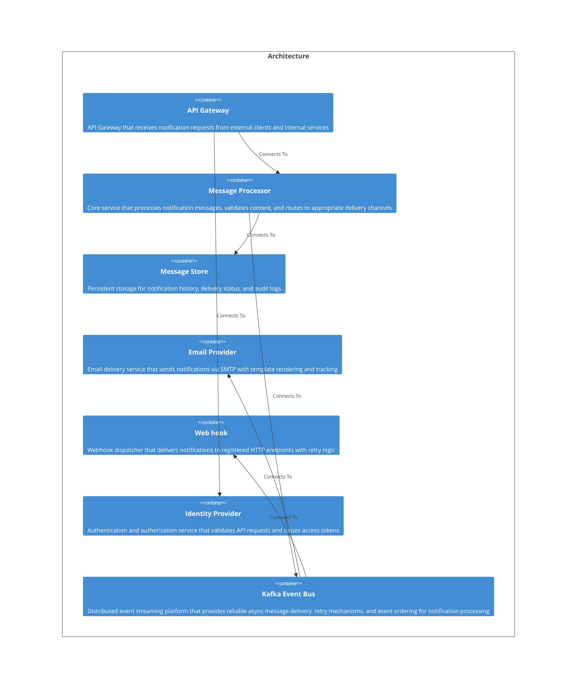

# Welcome to CALM Documentation

This documentation is generated from the **CALM Architecture-as-Code** model.

## High Level Architecture

## Nodes
    - [API Gateway](nodes/api-endpoint)
    - [Message Processor](nodes/message-processor)
    - [Message Store](nodes/message-store)
    - [Email Provider](nodes/email-provider)
    - [Web hook](nodes/webhook-target)
    - [Identity Provider](nodes/identity-provider)
    - [Kafka Event Bus](nodes/kafka-event-bus)

## Relationships
    - [Api To Identity Provider](relationships/api-to-identity-provider)
    - [Api To Processor](relationships/api-to-processor)
    - [Processor To Message Store](relationships/processor-to-message-store)
    - [Processor To Kafka](relationships/processor-to-kafka)
    - [Kafka To Email Provider](relationships/kafka-to-email-provider)
    - [Kafka To Webhook Target](relationships/kafka-to-webhook-target)

## Flows
    - [User Registration Welcome Email](flows/user-registration-welcome-email-flow)

## Controls
  _No Controls defined._

## Metadata
  

      <table>
          <thead>
          <tr>
              <th>Key</th>
              <th>Value</th>
          </tr>
          </thead>
          <tbody>
          <tr>
              <td>
                  <b>Owner</b>
              </td>
              <td>
                  john@architecthub.com
                      </td>
          </tr>
          <tr>
              <td>
                  <b>Version</b>
              </td>
              <td>
                  1.0.0
                      </td>
          </tr>
          <tr>
              <td>
                  <b>Created</b>
              </td>
              <td>
                  2025-12-30
                      </td>
          </tr>
          <tr>
              <td>
                  <b>Tags</b>
              </td>
              <td>
                  <ul>
                      <li>notifications</li>
                      <li>microservices</li>
                  </ul>
              </td>
          </tr>
          <tr>
              <td>
                  <b>RunbookUrl</b>
              </td>
              <td>
                  https://wiki.acme.corp/runbooks/notification-service
                      </td>
          </tr>
          <tr>
              <td>
                  <b>MonitoringDashboardUrl</b>
              </td>
              <td>
                  https://datadog.acme.corp/dashboard/notification-service
                      </td>
          </tr>
          <tr>
              <td>
                  <b>OncallRotation</b>
              </td>
              <td>
                  

                      <table>
                          <thead>
                          <tr>
                              <th>Key</th>
                              <th>Value</th>
                          </tr>
                          </thead>
                          <tbody>
                          <tr>
                              <td>
                                  <b>Primary</b>
                              </td>
                              <td>
                                  notifications-team
                                      </td>
                          </tr>
                          <tr>
                              <td>
                                  <b>Secondary</b>
                              </td>
                              <td>
                                  platform-team
                                      </td>
                          </tr>
                          <tr>
                              <td>
                                  <b>ScheduleUrl</b>
                              </td>
                              <td>
                                  https://pagerduty.acme.corp/schedules/notification-service
                                      </td>
                          </tr>
                          <tr>
                              <td>
                                  <b>EscalationPolicy</b>
                              </td>
                              <td>
                                  https://pagerduty.acme.corp/escalation-policies/notifications
                                      </td>
                          </tr>
                          </tbody>
                      </table>
                  

              </td>
          </tr>
          </tbody>
      </table>
  

## Adrs
  _No Adrs defined._
