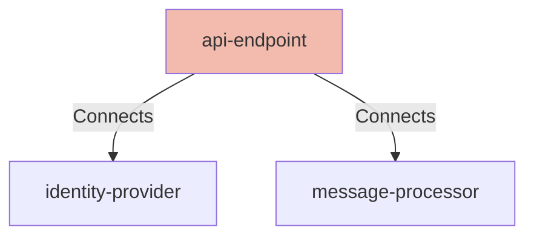

## Details

| Field               | Value                    |
|---------------------|--------------------------|
| **Unique ID**       | api-endpoint                   |
| **Node Type**       | gateway             |
| **Name**            | API Gateway                 |
| **Description**     | API Gateway that receives notification requests from external clients and internal services          |

## Interfaces
        

            <table>
                <thead>
                <tr>
                    <th>Key</th>
                    <th>Value</th>
                </tr>
                </thead>
                <tbody>
                <tr>
                    <td>
                        <b>UniqueId</b>
                    </td>
                    <td>
                        notification-rest-api
                            </td>
                </tr>
                <tr>
                    <td>
                        <b>AdditionalProperties</b>
                    </td>
                    <td>
                        

                            <table>
                                <thead>
                                <tr>
                                    <th>Key</th>
                                    <th>Value</th>
                                </tr>
                                </thead>
                                <tbody>
                                <tr>
                                    <td>
                                        <b>Name</b>
                                    </td>
                                    <td>
                                        Notification REST API
                                            </td>
                                </tr>
                                <tr>
                                    <td>
                                        <b>Description</b>
                                    </td>
                                    <td>
                                        RESTful API endpoint for submitting notification requests
                                            </td>
                                </tr>
                                <tr>
                                    <td>
                                        <b>Protocol</b>
                                    </td>
                                    <td>
                                        HTTPS
                                            </td>
                                </tr>
                                <tr>
                                    <td>
                                        <b>Port</b>
                                    </td>
                                    <td>
                                        443
                                            </td>
                                </tr>
                                <tr>
                                    <td>
                                        <b>Path</b>
                                    </td>
                                    <td>
                                        /api/v1/notifications
                                            </td>
                                </tr>
                                </tbody>
                            </table>
                        

                    </td>
                </tr>
                </tbody>
            </table>
        

## Related Nodes

## Controls
    _No controls defined._

## Metadata
  

      <table>
          <thead>
          <tr>
              <th>Key</th>
              <th>Value</th>
          </tr>
          </thead>
          <tbody>
          <tr>
              <td>
                  <b>Repository</b>
              </td>
              <td>
                  https://github.com/acme/notification-gateway
                      </td>
          </tr>
          <tr>
              <td>
                  <b>OncallChannel</b>
              </td>
              <td>
                  #notifications-oncall
                      </td>
          </tr>
          <tr>
              <td>
                  <b>DeploymentType</b>
              </td>
              <td>
                  container
                      </td>
          </tr>
          <tr>
              <td>
                  <b>Platform</b>
              </td>
              <td>
                  Kubernetes
                      </td>
          </tr>
          <tr>
              <td>
                  <b>Scaling</b>
              </td>
              <td>
                  

                      <table>
                          <thead>
                          <tr>
                              <th>Key</th>
                              <th>Value</th>
                          </tr>
                          </thead>
                          <tbody>
                          <tr>
                              <td>
                                  <b>Type</b>
                              </td>
                              <td>
                                  horizontal
                                      </td>
                          </tr>
                          <tr>
                              <td>
                                  <b>MinReplicas</b>
                              </td>
                              <td>
                                  3
                                      </td>
                          </tr>
                          <tr>
                              <td>
                                  <b>MaxReplicas</b>
                              </td>
                              <td>
                                  20
                                      </td>
                          </tr>
                          <tr>
                              <td>
                                  <b>TargetCPU</b>
                              </td>
                              <td>
                                  70%
                                      </td>
                          </tr>
                          <tr>
                              <td>
                                  <b>TargetMemory</b>
                              </td>
                              <td>
                                  80%
                                      </td>
                          </tr>
                          </tbody>
                      </table>
                  

              </td>
          </tr>
          <tr>
              <td>
                  <b>HealthCheck</b>
              </td>
              <td>
                  

                      <table>
                          <thead>
                          <tr>
                              <th>Key</th>
                              <th>Value</th>
                          </tr>
                          </thead>
                          <tbody>
                          <tr>
                              <td>
                                  <b>Endpoint</b>
                              </td>
                              <td>
                                  /health
                                      </td>
                          </tr>
                          <tr>
                              <td>
                                  <b>Port</b>
                              </td>
                              <td>
                                  8080
                                      </td>
                          </tr>
                          <tr>
                              <td>
                                  <b>Protocol</b>
                              </td>
                              <td>
                                  HTTP
                                      </td>
                          </tr>
                          </tbody>
                      </table>
                  

              </td>
          </tr>
          </tbody>
      </table>
  

