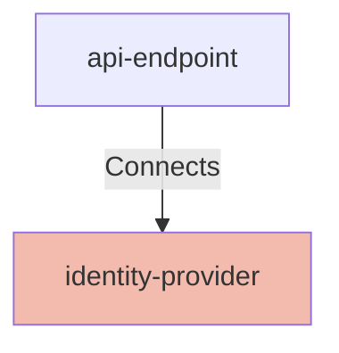

## Details

| Field               | Value                    |
|---------------------|--------------------------|
| **Unique ID**       | identity-provider                   |
| **Node Type**       | service             |
| **Name**            | Identity Provider                 |
| **Description**     | Authentication and authorization service that validates API requests and issues access tokens          |

## Interfaces
    _No interfaces defined._

## Related Nodes

## Controls
    _No controls defined._

## Metadata
  

      <table>
          <thead>
          <tr>
              <th>Key</th>
              <th>Value</th>
          </tr>
          </thead>
          <tbody>
          <tr>
              <td>
                  <b>Repository</b>
              </td>
              <td>
                  https://github.com/acme/identity-provider
                      </td>
          </tr>
          <tr>
              <td>
                  <b>OncallChannel</b>
              </td>
              <td>
                  #security-oncall
                      </td>
          </tr>
          <tr>
              <td>
                  <b>DeploymentType</b>
              </td>
              <td>
                  container
                      </td>
          </tr>
          <tr>
              <td>
                  <b>Platform</b>
              </td>
              <td>
                  Kubernetes
                      </td>
          </tr>
          <tr>
              <td>
                  <b>Scaling</b>
              </td>
              <td>
                  

                      <table>
                          <thead>
                          <tr>
                              <th>Key</th>
                              <th>Value</th>
                          </tr>
                          </thead>
                          <tbody>
                          <tr>
                              <td>
                                  <b>Type</b>
                              </td>
                              <td>
                                  horizontal
                                      </td>
                          </tr>
                          <tr>
                              <td>
                                  <b>MinReplicas</b>
                              </td>
                              <td>
                                  5
                                      </td>
                          </tr>
                          <tr>
                              <td>
                                  <b>MaxReplicas</b>
                              </td>
                              <td>
                                  25
                                      </td>
                          </tr>
                          <tr>
                              <td>
                                  <b>TargetCPU</b>
                              </td>
                              <td>
                                  75%
                                      </td>
                          </tr>
                          </tbody>
                      </table>
                  

              </td>
          </tr>
          <tr>
              <td>
                  <b>HealthCheck</b>
              </td>
              <td>
                  

                      <table>
                          <thead>
                          <tr>
                              <th>Key</th>
                              <th>Value</th>
                          </tr>
                          </thead>
                          <tbody>
                          <tr>
                              <td>
                                  <b>Endpoint</b>
                              </td>
                              <td>
                                  /health
                                      </td>
                          </tr>
                          <tr>
                              <td>
                                  <b>Port</b>
                              </td>
                              <td>
                                  8443
                                      </td>
                          </tr>
                          <tr>
                              <td>
                                  <b>Protocol</b>
                              </td>
                              <td>
                                  HTTPS
                                      </td>
                          </tr>
                          </tbody>
                      </table>
                  

              </td>
          </tr>
          </tbody>
      </table>
  

