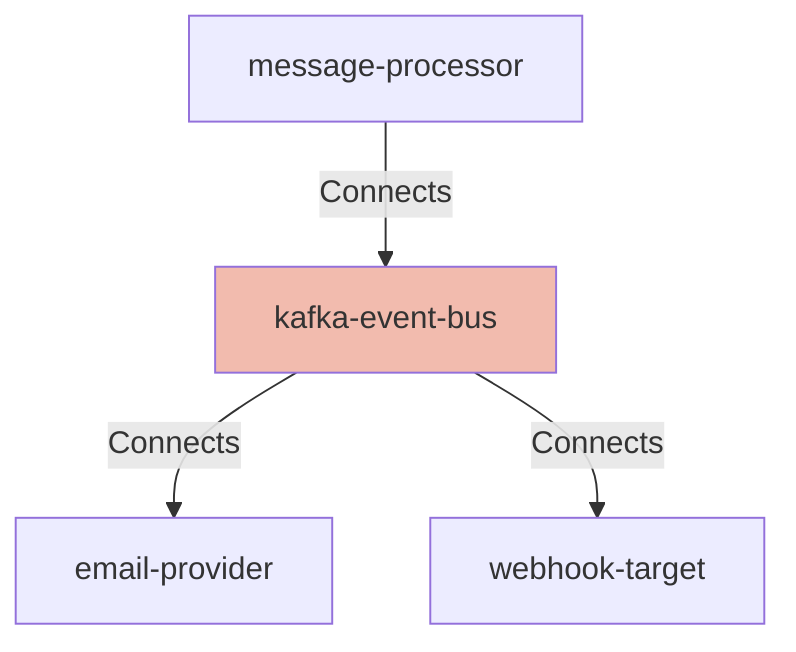

## Details

| Field               | Value                    |
|---------------------|--------------------------|
| **Unique ID**       | kafka-event-bus                   |
| **Node Type**       | system             |
| **Name**            | Kafka Event Bus                 |
| **Description**     | Distributed event streaming platform that provides reliable async message delivery, retry mechanisms, and event ordering for notification processing          |

## Interfaces
        

            <table>
                <thead>
                <tr>
                    <th>Key</th>
                    <th>Value</th>
                </tr>
                </thead>
                <tbody>
                <tr>
                    <td>
                        <b>UniqueId</b>
                    </td>
                    <td>
                        kafka-publisher
                            </td>
                </tr>
                <tr>
                    <td>
                        <b>AdditionalProperties</b>
                    </td>
                    <td>
                        

                            <table>
                                <thead>
                                <tr>
                                    <th>Key</th>
                                    <th>Value</th>
                                </tr>
                                </thead>
                                <tbody>
                                <tr>
                                    <td>
                                        <b>Name</b>
                                    </td>
                                    <td>
                                        Kafka Publisher Interface
                                            </td>
                                </tr>
                                <tr>
                                    <td>
                                        <b>Description</b>
                                    </td>
                                    <td>
                                        Interface for publishing notification events to Kafka topics
                                            </td>
                                </tr>
                                <tr>
                                    <td>
                                        <b>Protocol</b>
                                    </td>
                                    <td>
                                        AMQP
                                            </td>
                                </tr>
                                <tr>
                                    <td>
                                        <b>Port</b>
                                    </td>
                                    <td>
                                        9092
                                            </td>
                                </tr>
                                <tr>
                                    <td>
                                        <b>Metadata</b>
                                    </td>
                                    <td>
                                        

                                            <table>
                                                <thead>
                                                <tr>
                                                    <th>Key</th>
                                                    <th>Value</th>
                                                </tr>
                                                </thead>
                                                <tbody>
                                                <tr>
                                                    <td>
                                                        <b>Topics</b>
                                                    </td>
                                                    <td>
                                                        <ul>
                                                            <li>notification.email</li>
                                                            <li>notification.webhook</li>
                                                        </ul>
                                                    </td>
                                                </tr>
                                                </tbody>
                                            </table>
                                        

                                    </td>
                                </tr>
                                </tbody>
                            </table>
                        

                    </td>
                </tr>
                </tbody>
            </table>
        

        

            <table>
                <thead>
                <tr>
                    <th>Key</th>
                    <th>Value</th>
                </tr>
                </thead>
                <tbody>
                <tr>
                    <td>
                        <b>UniqueId</b>
                    </td>
                    <td>
                        kafka-consumer
                            </td>
                </tr>
                <tr>
                    <td>
                        <b>AdditionalProperties</b>
                    </td>
                    <td>
                        

                            <table>
                                <thead>
                                <tr>
                                    <th>Key</th>
                                    <th>Value</th>
                                </tr>
                                </thead>
                                <tbody>
                                <tr>
                                    <td>
                                        <b>Name</b>
                                    </td>
                                    <td>
                                        Kafka Consumer Interface
                                            </td>
                                </tr>
                                <tr>
                                    <td>
                                        <b>Description</b>
                                    </td>
                                    <td>
                                        Interface for subscribing to and consuming notification events from Kafka topics
                                            </td>
                                </tr>
                                <tr>
                                    <td>
                                        <b>Protocol</b>
                                    </td>
                                    <td>
                                        AMQP
                                            </td>
                                </tr>
                                <tr>
                                    <td>
                                        <b>Port</b>
                                    </td>
                                    <td>
                                        9092
                                            </td>
                                </tr>
                                <tr>
                                    <td>
                                        <b>Metadata</b>
                                    </td>
                                    <td>
                                        

                                            <table>
                                                <thead>
                                                <tr>
                                                    <th>Key</th>
                                                    <th>Value</th>
                                                </tr>
                                                </thead>
                                                <tbody>
                                                <tr>
                                                    <td>
                                                        <b>ConsumerGroups</b>
                                                    </td>
                                                    <td>
                                                        <ul>
                                                            <li>email-delivery-group</li>
                                                            <li>webhook-delivery-group</li>
                                                        </ul>
                                                    </td>
                                                </tr>
                                                </tbody>
                                            </table>
                                        

                                    </td>
                                </tr>
                                </tbody>
                            </table>
                        

                    </td>
                </tr>
                </tbody>
            </table>
        

## Related Nodes

## Controls

        ### Encryption At Rest

        Kafka topic and log encryption for event data

        

            <table>
                <thead>
                <tr>
                    <th>Requirement URL</th>
                    <th>Config</th>
                </tr>
                </thead>
                <tbody>
                    <tr>
                        <td>
                                <a href="https://internal-policy.acme.com/security/kafka-encryption" target="_blank">
                                    https://internal-policy.acme.com/security/kafka-encryption
                                </a>
                        </td>

                        <td>
                                <table>
                                    <thead>
                                    <tr>
                                        <th>Key</th>
                                        <th>Value</th>
                                    </tr>
                                    </thead>
                                    <tbody>
                                        <tr>
                                            <td>logEncryption</td>
                                            <td>true</td>
                                        </tr>
                                        <tr>
                                            <td>encryptionAlgorithm</td>
                                            <td>AES-256-GCM</td>
                                        </tr>
                                        <tr>
                                            <td>storageClass</td>
                                            <td>encrypted</td>
                                        </tr>
                                        <tr>
                                            <td>kmsKeyArn</td>
                                            <td>arn:aws:kms:us-east-1:123456789:key/kafka-storage</td>
                                        </tr>
                                        <tr>
                                            <td>topicRetention</td>
                                            <td>7 days</td>
                                        </tr>
                                    </tbody>
                                </table>

                        </td>
                    </tr>
                </tbody>
            </table>
        

        ### Encryption In Transit

        Kafka broker and client TLS encryption requirements

        

            <table>
                <thead>
                <tr>
                    <th>Requirement URL</th>
                    <th>Config</th>
                </tr>
                </thead>
                <tbody>
                    <tr>
                        <td>
                                <a href="https://internal-policy.acme.com/security/kafka-tls" target="_blank">
                                    https://internal-policy.acme.com/security/kafka-tls
                                </a>
                        </td>

                        <td>
                                <table>
                                    <thead>
                                    <tr>
                                        <th>Key</th>
                                        <th>Value</th>
                                    </tr>
                                    </thead>
                                    <tbody>
                                        <tr>
                                            <td>listeners</td>
                                            <td>SSL://9093</td>
                                        </tr>
                                        <tr>
                                            <td>securityProtocol</td>
                                            <td>SASL_SSL</td>
                                        </tr>
                                        <tr>
                                            <td>saslMechanism</td>
                                            <td>SCRAM-SHA-512</td>
                                        </tr>
                                        <tr>
                                            <td>sslProtocol</td>
                                            <td>TLSv1.3</td>
                                        </tr>
                                        <tr>
                                            <td>sslCipherSuites</td>
                                            <td>TLS_AES_256_GCM_SHA384</td>
                                        </tr>
                                        <tr>
                                            <td>clientAuth</td>
                                            <td>required</td>
                                        </tr>
                                    </tbody>
                                </table>

                        </td>
                    </tr>
                </tbody>
            </table>
        

        ### Access Control

        Kafka ACLs for topic-level authorization

        

            <table>
                <thead>
                <tr>
                    <th>Requirement URL</th>
                    <th>Config</th>
                </tr>
                </thead>
                <tbody>
                    <tr>
                        <td>
                                <a href="https://internal-policy.acme.com/security/kafka-acls" target="_blank">
                                    https://internal-policy.acme.com/security/kafka-acls
                                </a>
                        </td>

                        <td>
                                <table>
                                    <thead>
                                    <tr>
                                        <th>Key</th>
                                        <th>Value</th>
                                    </tr>
                                    </thead>
                                    <tbody>
                                        <tr>
                                            <td>aclEnabled</td>
                                            <td>true</td>
                                        </tr>
                                        <tr>
                                            <td>topics</td>
                                            <td>[object Object]</td>
                                        </tr>
                                    </tbody>
                                </table>

                        </td>
                    </tr>
                </tbody>
            </table>
        

## Metadata
  

      <table>
          <thead>
          <tr>
              <th>Key</th>
              <th>Value</th>
          </tr>
          </thead>
          <tbody>
          <tr>
              <td>
                  <b>Repository</b>
              </td>
              <td>
                  https://github.com/acme/kafka-cluster
                      </td>
          </tr>
          <tr>
              <td>
                  <b>OncallChannel</b>
              </td>
              <td>
                  #platform-oncall
                      </td>
          </tr>
          <tr>
              <td>
                  <b>DeploymentType</b>
              </td>
              <td>
                  statefulset
                      </td>
          </tr>
          <tr>
              <td>
                  <b>Platform</b>
              </td>
              <td>
                  Kubernetes
                      </td>
          </tr>
          <tr>
              <td>
                  <b>Scaling</b>
              </td>
              <td>
                  

                      <table>
                          <thead>
                          <tr>
                              <th>Key</th>
                              <th>Value</th>
                          </tr>
                          </thead>
                          <tbody>
                          <tr>
                              <td>
                                  <b>Type</b>
                              </td>
                              <td>
                                  cluster
                                      </td>
                          </tr>
                          <tr>
                              <td>
                                  <b>Brokers</b>
                              </td>
                              <td>
                                  5
                                      </td>
                          </tr>
                          <tr>
                              <td>
                                  <b>Partitions</b>
                              </td>
                              <td>
                                  12
                                      </td>
                          </tr>
                          <tr>
                              <td>
                                  <b>ReplicationFactor</b>
                              </td>
                              <td>
                                  3
                                      </td>
                          </tr>
                          </tbody>
                      </table>
                  

              </td>
          </tr>
          <tr>
              <td>
                  <b>HealthCheck</b>
              </td>
              <td>
                  

                      <table>
                          <thead>
                          <tr>
                              <th>Key</th>
                              <th>Value</th>
                          </tr>
                          </thead>
                          <tbody>
                          <tr>
                              <td>
                                  <b>Endpoint</b>
                              </td>
                              <td>
                                  /
                                      </td>
                          </tr>
                          <tr>
                              <td>
                                  <b>Port</b>
                              </td>
                              <td>
                                  9092
                                      </td>
                          </tr>
                          <tr>
                              <td>
                                  <b>Protocol</b>
                              </td>
                              <td>
                                  TCP
                                      </td>
                          </tr>
                          </tbody>
                      </table>
                  

              </td>
          </tr>
          </tbody>
      </table>
  

