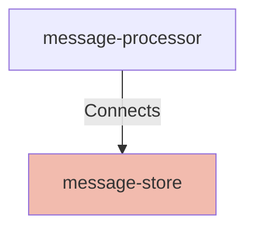

## Details

| Field               | Value                    |
|---------------------|--------------------------|
| **Unique ID**       | message-store                   |
| **Node Type**       | database             |
| **Name**            | Message Store                 |
| **Description**     | Persistent storage for notification history, delivery status, and audit logs          |

## Interfaces
        

            <table>
                <thead>
                <tr>
                    <th>Key</th>
                    <th>Value</th>
                </tr>
                </thead>
                <tbody>
                <tr>
                    <td>
                        <b>UniqueId</b>
                    </td>
                    <td>
                        database-connection
                            </td>
                </tr>
                <tr>
                    <td>
                        <b>AdditionalProperties</b>
                    </td>
                    <td>
                        

                            <table>
                                <thead>
                                <tr>
                                    <th>Key</th>
                                    <th>Value</th>
                                </tr>
                                </thead>
                                <tbody>
                                <tr>
                                    <td>
                                        <b>Name</b>
                                    </td>
                                    <td>
                                        Database Connection
                                            </td>
                                </tr>
                                <tr>
                                    <td>
                                        <b>Description</b>
                                    </td>
                                    <td>
                                        PostgreSQL database connection interface for storing notification messages and delivery status
                                            </td>
                                </tr>
                                <tr>
                                    <td>
                                        <b>Protocol</b>
                                    </td>
                                    <td>
                                        JDBC
                                            </td>
                                </tr>
                                <tr>
                                    <td>
                                        <b>Port</b>
                                    </td>
                                    <td>
                                        5432
                                            </td>
                                </tr>
                                </tbody>
                            </table>
                        

                    </td>
                </tr>
                </tbody>
            </table>
        

## Related Nodes

## Controls

        ### Encryption At Rest

        PostgreSQL database encryption for notification history and PII

        

            <table>
                <thead>
                <tr>
                    <th>Requirement URL</th>
                    <th>Config</th>
                </tr>
                </thead>
                <tbody>
                    <tr>
                        <td>
                                <a href="https://internal-policy.acme.com/security/rds-encryption" target="_blank">
                                    https://internal-policy.acme.com/security/rds-encryption
                                </a>
                        </td>

                        <td>
                                <table>
                                    <thead>
                                    <tr>
                                        <th>Key</th>
                                        <th>Value</th>
                                    </tr>
                                    </thead>
                                    <tbody>
                                        <tr>
                                            <td>transparentDataEncryption</td>
                                            <td>true</td>
                                        </tr>
                                        <tr>
                                            <td>kmsKeyArn</td>
                                            <td>arn:aws:kms:us-east-1:123456789:key/notification-store</td>
                                        </tr>
                                        <tr>
                                            <td>storageEncrypted</td>
                                            <td>true</td>
                                        </tr>
                                        <tr>
                                            <td>backupEncryption</td>
                                            <td>true</td>
                                        </tr>
                                        <tr>
                                            <td>performanceInsights</td>
                                            <td>[object Object]</td>
                                        </tr>
                                    </tbody>
                                </table>

                        </td>
                    </tr>
                </tbody>
            </table>
        

        ### Encryption In Transit

        PostgreSQL SSL/TLS requirements for client connections

        

            <table>
                <thead>
                <tr>
                    <th>Requirement URL</th>
                    <th>Config</th>
                </tr>
                </thead>
                <tbody>
                    <tr>
                        <td>
                                <a href="https://internal-policy.acme.com/security/database-ssl" target="_blank">
                                    https://internal-policy.acme.com/security/database-ssl
                                </a>
                        </td>

                        <td>
                                <table>
                                    <thead>
                                    <tr>
                                        <th>Key</th>
                                        <th>Value</th>
                                    </tr>
                                    </thead>
                                    <tbody>
                                        <tr>
                                            <td>sslMode</td>
                                            <td>verify-full</td>
                                        </tr>
                                        <tr>
                                            <td>tlsVersion</td>
                                            <td>1.3</td>
                                        </tr>
                                        <tr>
                                            <td>certificateValidation</td>
                                            <td>required</td>
                                        </tr>
                                        <tr>
                                            <td>clientCertificates</td>
                                            <td>false</td>
                                        </tr>
                                    </tbody>
                                </table>

                        </td>
                    </tr>
                </tbody>
            </table>
        

        ### Pii Protection

        Column-level encryption for sensitive notification data

        

            <table>
                <thead>
                <tr>
                    <th>Requirement URL</th>
                    <th>Config</th>
                </tr>
                </thead>
                <tbody>
                    <tr>
                        <td>
                                <a href="https://internal-policy.acme.com/security/column-encryption" target="_blank">
                                    https://internal-policy.acme.com/security/column-encryption
                                </a>
                        </td>

                        <td>
                                <table>
                                    <thead>
                                    <tr>
                                        <th>Key</th>
                                        <th>Value</th>
                                    </tr>
                                    </thead>
                                    <tbody>
                                        <tr>
                                            <td>encryptedColumns</td>
                                            <td>recipient_email,recipient_phone,notification_content,user_metadata</td>
                                        </tr>
                                        <tr>
                                            <td>encryptionKey</td>
                                            <td>application-level</td>
                                        </tr>
                                        <tr>
                                            <td>searchableEncryption</td>
                                            <td>false</td>
                                        </tr>
                                    </tbody>
                                </table>

                        </td>
                    </tr>
                </tbody>
            </table>
        

        ### Pii Access Control

        Role-based and attribute-based access for PII fields

        

            <table>
                <thead>
                <tr>
                    <th>Requirement URL</th>
                    <th>Config</th>
                </tr>
                </thead>
                <tbody>
                    <tr>
                        <td>
                                <a href="https://internal-policy.acme.com/security/pii-access" target="_blank">
                                    https://internal-policy.acme.com/security/pii-access
                                </a>
                        </td>

                        <td>
                                <table>
                                    <thead>
                                    <tr>
                                        <th>Key</th>
                                        <th>Value</th>
                                    </tr>
                                    </thead>
                                    <tbody>
                                        <tr>
                                            <td>model</td>
                                            <td>ABAC</td>
                                        </tr>
                                        <tr>
                                            <td>policies</td>
                                            <td>[object Object]</td>
                                        </tr>
                                        <tr>
                                            <td>breakGlassAccess</td>
                                            <td>[object Object]</td>
                                        </tr>
                                    </tbody>
                                </table>

                        </td>
                    </tr>
                </tbody>
            </table>
        

        ### Pii Discovery

        Automated PII field discovery and classification

        

            <table>
                <thead>
                <tr>
                    <th>Requirement URL</th>
                    <th>Config</th>
                </tr>
                </thead>
                <tbody>
                    <tr>
                        <td>
                                <a href="https://internal-policy.acme.com/security/pii-discovery" target="_blank">
                                    https://internal-policy.acme.com/security/pii-discovery
                                </a>
                        </td>

                        <td>
                                <table>
                                    <thead>
                                    <tr>
                                        <th>Key</th>
                                        <th>Value</th>
                                    </tr>
                                    </thead>
                                    <tbody>
                                        <tr>
                                            <td>scanningEnabled</td>
                                            <td>true</td>
                                        </tr>
                                        <tr>
                                            <td>scanFrequency</td>
                                            <td>weekly</td>
                                        </tr>
                                        <tr>
                                            <td>classificationLevels</td>
                                            <td>public,internal,confidential,restricted</td>
                                        </tr>
                                        <tr>
                                            <td>piiCategories</td>
                                            <td>[object Object]</td>
                                        </tr>
                                    </tbody>
                                </table>

                        </td>
                    </tr>
                </tbody>
            </table>
        

## Metadata
  

      <table>
          <thead>
          <tr>
              <th>Key</th>
              <th>Value</th>
          </tr>
          </thead>
          <tbody>
          <tr>
              <td>
                  <b>Repository</b>
              </td>
              <td>
                  https://github.com/acme/notification-infrastructure
                      </td>
          </tr>
          <tr>
              <td>
                  <b>OncallChannel</b>
              </td>
              <td>
                  #notifications-oncall
                      </td>
          </tr>
          <tr>
              <td>
                  <b>DeploymentType</b>
              </td>
              <td>
                  managed-database
                      </td>
          </tr>
          <tr>
              <td>
                  <b>Platform</b>
              </td>
              <td>
                  AWS RDS PostgreSQL
                      </td>
          </tr>
          <tr>
              <td>
                  <b>Scaling</b>
              </td>
              <td>
                  

                      <table>
                          <thead>
                          <tr>
                              <th>Key</th>
                              <th>Value</th>
                          </tr>
                          </thead>
                          <tbody>
                          <tr>
                              <td>
                                  <b>Type</b>
                              </td>
                              <td>
                                  vertical
                                      </td>
                          </tr>
                          <tr>
                              <td>
                                  <b>InstanceClass</b>
                              </td>
                              <td>
                                  db.r5.xlarge
                                      </td>
                          </tr>
                          <tr>
                              <td>
                                  <b>Storage</b>
                              </td>
                              <td>
                                  500GB
                                      </td>
                          </tr>
                          <tr>
                              <td>
                                  <b>Iops</b>
                              </td>
                              <td>
                                  3000
                                      </td>
                          </tr>
                          </tbody>
                      </table>
                  

              </td>
          </tr>
          <tr>
              <td>
                  <b>HealthCheck</b>
              </td>
              <td>
                  

                      <table>
                          <thead>
                          <tr>
                              <th>Key</th>
                              <th>Value</th>
                          </tr>
                          </thead>
                          <tbody>
                          <tr>
                              <td>
                                  <b>Endpoint</b>
                              </td>
                              <td>
                                  tcp
                                      </td>
                          </tr>
                          <tr>
                              <td>
                                  <b>Port</b>
                              </td>
                              <td>
                                  5432
                                      </td>
                          </tr>
                          <tr>
                              <td>
                                  <b>Protocol</b>
                              </td>
                              <td>
                                  TCP
                                      </td>
                          </tr>
                          </tbody>
                      </table>
                  

              </td>
          </tr>
          </tbody>
      </table>
  

