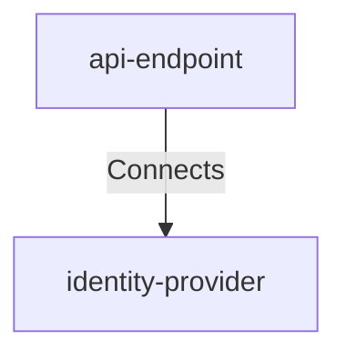

## Details

| Field               | Value                    |
|---------------------|--------------------------|
| **Unique ID**       | api-to-identity-provider                   |
| **Description**      |  API Gateway authenticates incoming requests by validating tokens with the Identity Provider before allowing access to notification services   |

## Related Nodes

## Controls

        ### Authentication

        Token validation protocol and performance requirements

        

            <table>
                <thead>
                <tr>
                    <th>Requirement URL</th>
                    <th>Config</th>
                </tr>
                </thead>
                <tbody>
                    <tr>
                        <td>
                                <a href="https://internal-policy.acme.com/security/token-validation-protocol" target="_blank">
                                    https://internal-policy.acme.com/security/token-validation-protocol
                                </a>
                        </td>

                        <td>
                                <table>
                                    <thead>
                                    <tr>
                                        <th>Key</th>
                                        <th>Value</th>
                                    </tr>
                                    </thead>
                                    <tbody>
                                        <tr>
                                            <td>protocol</td>
                                            <td>OAuth2 RFC 7662 Token Introspection</td>
                                        </tr>
                                        <tr>
                                            <td>timeoutMs</td>
                                            <td>100</td>
                                        </tr>
                                        <tr>
                                            <td>retryPolicy</td>
                                            <td>exponential-backoff</td>
                                        </tr>
                                        <tr>
                                            <td>maxRetries</td>
                                            <td>2</td>
                                        </tr>
                                        <tr>
                                            <td>fallbackBehavior</td>
                                            <td>reject-request</td>
                                        </tr>
                                    </tbody>
                                </table>

                        </td>
                    </tr>
                </tbody>
            </table>
        

## Metadata
  _No Metadata defined._
