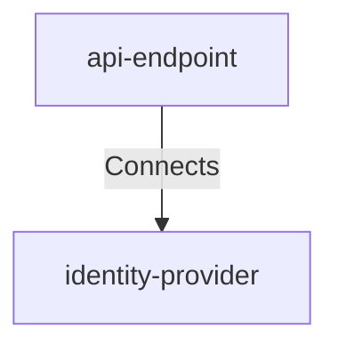

## Details

| Field               | Value                    |
|---------------------|--------------------------|
| **Unique ID**       | api-to-identity-provider                   |
| **Description**      |  API Gateway authenticates incoming requests by validating tokens with the Identity Provider before allowing access to notification services   |

## Related Nodes

## Controls
    _No controls defined._

## Metadata
  _No Metadata defined._
