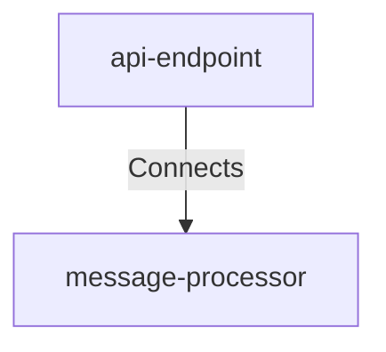

## Details

| Field               | Value                    |
|---------------------|--------------------------|
| **Unique ID**       | api-to-processor                   |
| **Description**      |  API Gateway forwards incoming notification requests with payload metadata to Message Processor   |

## Related Nodes

## Controls
    _No controls defined._

## Metadata
  _No Metadata defined._
