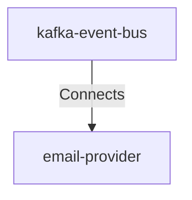

## Details

| Field               | Value                    |
|---------------------|--------------------------|
| **Unique ID**       | kafka-to-email-provider                   |
| **Description**      |  Kafka consumers read email notification events and forward them to the Email Provider with automatic retry on failures   |

## Related Nodes

## Controls
    _No controls defined._

## Metadata
  _No Metadata defined._
