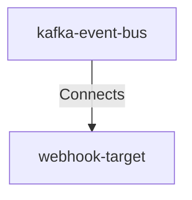

## Details

| Field               | Value                    |
|---------------------|--------------------------|
| **Unique ID**       | kafka-to-webhook-target                   |
| **Description**      |  Kafka consumers read webhook notification events and deliver them to external webhook targets with exponential backoff retry strategy   |

## Related Nodes

## Controls
    _No controls defined._

## Metadata
  _No Metadata defined._
