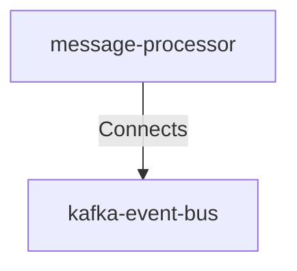

## Details

| Field               | Value                    |
|---------------------|--------------------------|
| **Unique ID**       | processor-to-kafka                   |
| **Description**      |  Message Processor publishes notification events to Kafka topics for reliable async processing and delivery   |

## Related Nodes

## Controls

        ### Encryption In Transit

        Kafka TLS encryption for producer connections

        

            <table>
                <thead>
                <tr>
                    <th>Requirement URL</th>
                    <th>Config</th>
                </tr>
                </thead>
                <tbody>
                    <tr>
                        <td>
                                <a href="https://internal-policy.acme.com/security/kafka-producer-tls" target="_blank">
                                    https://internal-policy.acme.com/security/kafka-producer-tls
                                </a>
                        </td>

                        <td>
                                <table>
                                    <thead>
                                    <tr>
                                        <th>Key</th>
                                        <th>Value</th>
                                    </tr>
                                    </thead>
                                    <tbody>
                                        <tr>
                                            <td>securityProtocol</td>
                                            <td>SASL_SSL</td>
                                        </tr>
                                        <tr>
                                            <td>saslMechanism</td>
                                            <td>SCRAM-SHA-512</td>
                                        </tr>
                                        <tr>
                                            <td>sslTruststoreLocation</td>
                                            <td>/etc/kafka/ssl/truststore.jks</td>
                                        </tr>
                                        <tr>
                                            <td>sslKeystoreLocation</td>
                                            <td>/etc/kafka/ssl/keystore.jks</td>
                                        </tr>
                                        <tr>
                                            <td>sslEndpointIdentificationAlgorithm</td>
                                            <td>https</td>
                                        </tr>
                                    </tbody>
                                </table>

                        </td>
                    </tr>
                </tbody>
            </table>
        

## Metadata
  _No Metadata defined._
